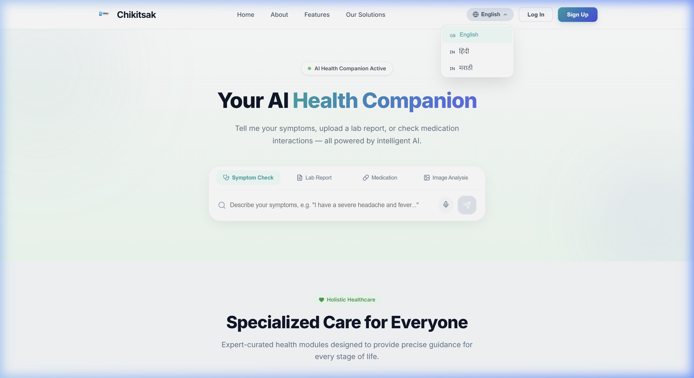
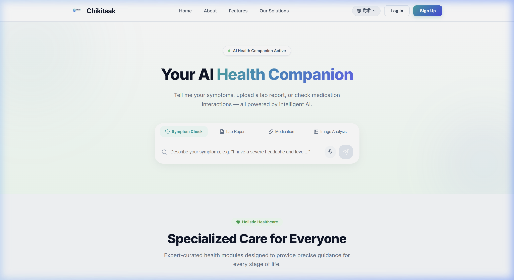

<p align="center">
  
</p>

<h1 align="center">Chikitsak AI — Personalized Health Operating System</h1>

<p align="center">
  <strong>An AI-powered health companion providing real-time symptom triage, lab report analysis, medication checks, and medical image insights — all from one intelligent interface.</strong>
</p>

<p align="center">
  
  
  
  
  
  
</p>

---

## 📹 Demo Video

> Full walkthrough showing landing page, login, AI chat workspace, and dashboard navigation.

<p align="center">
  
</p>

---

## 📸 Screenshots

### 🏠 Landing Page — Hero Section
> Clean glassmorphism design with AI Health Companion search bar, voice input, and quick-action tabs.

<p align="center">
  
</p>

### 🩺 Specialized Care Areas
> Expert-curated health modules for maternity, pediatrics, mental health, and more.

<p align="center">
  
</p>

### 🌐 Multi-Language Support
> Switch between English, हिंदी (Hindi), and मराठी (Marathi) — language persists across sessions.

| Language Dropdown | Hindi View |
|:-:|:-:|
|  |  |

### 🔐 Authentication
> Secure login with JWT-based authentication. Dual-panel design with branded illustration.

| Login Page | Signup Page |
|:-:|:-:|
|  |  |

### 💬 AI Chat Workspace
> 3-panel layout: chat history (left), conversation (center), AI insights panel (right) with triage level, possible causes, and confidence scores.

<p align="center">
  
</p>

### 📊 Health Dashboard
> Comprehensive daily overview with health score, vital signs, wellness trends, AQI monitoring, and daily AI insights.

<p align="center">
  
</p>

### 📍 Location Health
> Real-time environmental health data (AQI, temperature, humidity), trending local illnesses, and area-specific health alerts.

<p align="center">
  
</p>

### 📋 My Health Records
> Manage medical history, lab reports, and health documents in one unified interface.

<p align="center">
  
</p>

---

## ⚡ Features

| Feature | Description |
|---------|-------------|
| 🩺 **AI Symptom Triage** | Real-time symptom analysis with emergency detection, triage levels, and confidence scoring |
| 📄 **Lab Report Analysis** | Upload and get AI-powered interpretation of blood work, CBCs, and more |
| 💊 **Medication Check** | Drug interaction checks and dosage information |
| 🖼️ **Medical Image Analysis** | Upload X-rays or medical images for AI-assisted analysis |
| 🌐 **Multi-Language** | Full i18n support — English, Hindi (हिंदी), Marathi (मराठी) |
| 📊 **Health Dashboard** | Daily health score, vital monitoring, wellness trends |
| 📍 **Location Health** | AQI, temperature, humidity, and local disease trends for your area |
| 🗣️ **Voice Input** | Speak your symptoms using browser speech recognition |
| 🚨 **Emergency Detection** | Automatic emergency alerts for critical symptoms (chest pain, breathing difficulty) |
| 🔐 **JWT Authentication** | Secure register/login with token-based auth |

---

## 🏗 Architecture

```
┌──────────────────────────────────────────────────┐
│                   FRONTEND                       │
│              Next.js 14 (App Router)             │
│                                                  │
│  ┌──────────┐ ┌──────────┐ ┌──────────────────┐  │
│  │  Navbar  │ │ Sidebar  │ │   Pages (23+)    │  │
│  │  Footer  │ │ Collapse │ │ Dashboard, Chat, │  │
│  │  i18n    │ │  Mobile  │ │ Reports, Health  │  │
│  └──────────┘ └──────────┘ └──────────────────┘  │
│                     │                            │
│           ┌─────────▼─────────┐                  │
│           │  Zustand Store    │                  │
│           │  (Global State)   │                  │
│           └─────────┬─────────┘                  │
└─────────────────────┼────────────────────────────┘
                      │  fetch() + JWT Bearer
                      ▼
┌──────────────────────────────────────────────────┐
│                   BACKEND                        │
│               FastAPI (Python)                   │
│                                                  │
│  ┌────────────┐ ┌─────────────┐ ┌─────────────┐ │
│  │ POST /chat │ │ /auth/login │ │ /auth/      │ │
│  │            │ │ /auth/reg   │ │  register   │ │
│  └─────┬──────┘ └──────┬──────┘ └─────────────┘ │
│        │               │                        │
│  ┌─────▼──────┐  ┌─────▼──────┐                 │
│  │  Gemini AI │  │  JWT Auth  │                 │
│  │  MedQuAD   │  │  bcrypt    │                 │
│  │  ML Models │  │  SQLAlchemy│                 │
│  └────────────┘  └────────────┘                 │
└──────────────────────────────────────────────────┘
```

---

## 🚀 Getting Started

### Prerequisites

- **Node.js** >= 18.x
- **Python** >= 3.10
- **npm** or **yarn**
- **Google Gemini API Key** (for AI chat)

### 1. Clone the Repository

```bash
git clone https://github.com/Dipankar2105/Chikitsak-AI-Powered-Personalized-Health-Operating-System.git
cd Chikitsak-AI-Powered-Personalized-Health-Operating-System
```

### 2. Backend Setup

```bash
# Create virtual environment
python -m venv venv
source venv/bin/activate  # On Windows: venv\Scripts\activate

# Install dependencies
pip install -r requirements.txt

# Set environment variables
cp .env.example .env
# Edit .env and add your GEMINI_API_KEY

# Start the backend
uvicorn backend.app.main:app --host 127.0.0.1 --port 8000
```

### 3. Frontend Setup

```bash
cd frontend

# Install dependencies
npm install

# Start the dev server
npm run dev
```

### 4. Open in Browser

Navigate to **http://localhost:3000** 🎉

---

## 🗂 Project Structure

```
chikitsak/
├── backend/
│   ├── app/
│   │   ├── main.py              # FastAPI app entry point
│   │   ├── routes/
│   │   │   ├── auth.py          # /auth/login, /auth/register
│   │   │   └── chat.py          # POST /chat (AI triage)
│   │   ├── services/
│   │   │   ├── auth_service.py  # JWT token handling
│   │   │   └── ai_engine.py     # Gemini AI + MedQuAD integration
│   │   └── models/              # SQLAlchemy models
│   └── tests/                   # API tests
├── frontend/
│   ├── src/
│   │   ├── app/                 # Next.js App Router pages
│   │   │   ├── page.tsx         # Landing page
│   │   │   ├── login/           # Login page
│   │   │   ├── signup/          # Multi-step signup
│   │   │   └── app/             # Authenticated app pages
│   │   │       ├── workspace/   # AI Chat workspace
│   │   │       ├── dashboard/   # Health dashboard
│   │   │       └── ...          # 20+ more pages
│   │   ├── components/          # Navbar, Sidebar, Footer, etc.
│   │   ├── store/               # Zustand global state
│   │   └── locales/             # en.json, hi.json, mr.json
│   └── public/                  # Static assets, logo
├── docs/
│   ├── screenshots/             # All UI screenshots
│   ├── demo_walkthrough.webp    # Landing page demo video
│   └── app_demo.webp            # Full app demo video
├── .gitignore
└── README.md
```

---

## 🌍 Supported Languages

| Language | Code | Status |
|----------|------|--------|
| English | `en` | ✅ Complete |
| Hindi (हिंदी) | `hi` | ✅ Complete |
| Marathi (मराठी) | `mr` | ✅ Complete |

---

## 🔑 API Endpoints

| Method | Endpoint | Description | Auth |
|--------|----------|-------------|------|
| `POST` | `/auth/register` | Register new user | ❌ |
| `POST` | `/auth/login` | Login & get JWT token | ❌ |
| `POST` | `/chat` | Send message to AI health engine | ✅ Bearer |
| `GET` | `/health/triage` | Symptom triage analysis | ✅ Bearer |
| `GET` | `/docs` | Swagger API documentation | ❌ |

---

## 🛡️ Security & Disclaimer

> ⚕️ **Medical Disclaimer**: Chikitsak is an AI-powered **educational tool**. It does **NOT** provide medical diagnosis or treatment. Always consult a qualified healthcare provider for any medical concerns. In case of a medical emergency, call your local emergency services immediately.

- JWT-based authentication with bcrypt password hashing
- CORS configured for frontend origin
- No patient data stored permanently
- All AI responses include confidence scores and disclaimers

---

## 🤝 Contributing

1. Fork the repository
2. Create a feature branch (`git checkout -b feature/amazing-feature`)
3. Commit your changes (`git commit -m 'Add amazing feature'`)
4. Push to the branch (`git push origin feature/amazing-feature`)
5. Open a Pull Request

---

## 📄 License

This project is licensed under the **MIT License** — see the [LICENSE](LICENSE) file for details.

---

## 👨‍💻 Author

**Dipankar Pimple**
- GitHub: [@Dipankar2105](https://github.com/Dipankar2105)

---

<p align="center">
  Made with ❤️ for accessible healthcare
</p>
