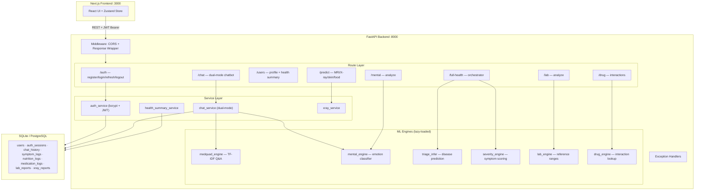
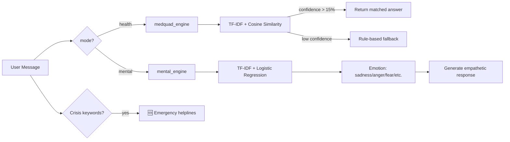
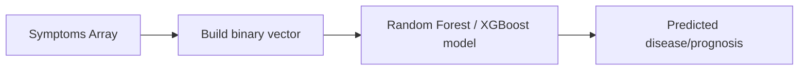
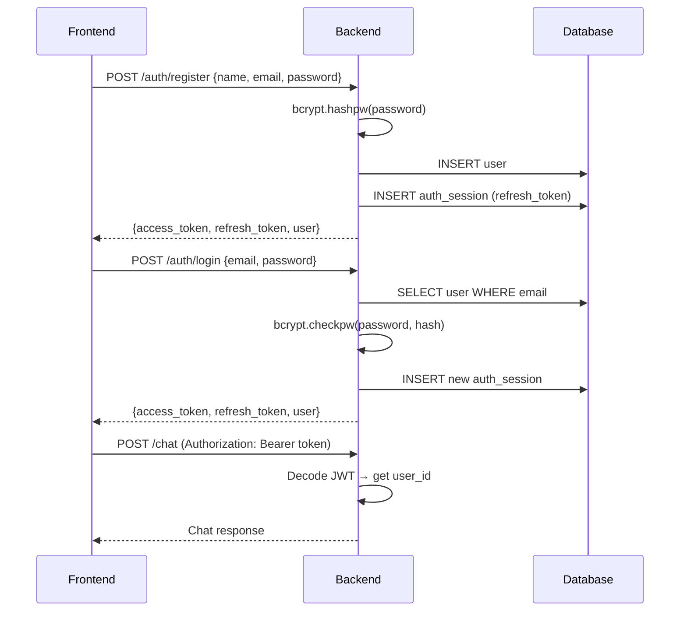

<p align="center">
  
</p>

<h1 align="center">Chikitsak AI — Personalized Health Operating System</h1>

<p align="center">
  <strong>An AI-powered health companion providing real-time symptom triage, lab report analysis, medication checks, and medical image insights — all from one intelligent interface.</strong>
</p>

<p align="center">
  
  
  
  
  
</p>

---

## 📹 Demo Video


https://github.com/user-attachments/assets/1eded125-bfd5-42ec-929e-534510aad79f


> Full walkthrough showing landing page, login, AI chat workspace, emergency detection, dashboard, and more.

<p align="center">
  <a href="https://www.youtube.com/watch?v=tgbNymZ7vqY">
    
  </a>
</p>

<p align="center">
  <strong>▶ <a href="https://youtu.be/JO4dhjSGl1w">Watch the full demo on YouTube</a></strong>
</p>

---

## 📸 Screenshots

### 🏠 Landing Page — Hero Section
> Clean glassmorphism design with AI Health Companion search bar, voice input, and quick-action tabs.

<p align="center">
  
</p>

### 🩺 Specialized Care Areas
> Expert-curated health modules for maternity, pediatrics, mental health, and more.

<p align="center">
  
</p>

### ⭐ Community Reviews & Footer

<p align="center">
  
</p>

### 🔐 Authentication
> Secure login with JWT-based authentication. Dual-panel design with branded illustration.

| Login Page | Signup Page |
|:-:|:-:|
|  |  |

### 💬 AI Chat Workspace
> 3-panel layout: chat history (left), conversation (center), AI insights panel (right) with triage level, possible causes, and confidence scores.

<p align="center">
  
</p>

### � Emergency Detection
> When critical symptoms (chest pain, heart attack, breathing difficulty) are detected, the system triggers an **Emergency Alert** — displaying red flags, possible causes (Acute Coronary Syndrome, Pulmonary Embolism), immediate next steps, and a full-screen emergency overlay with a direct call-to-action to contact 112.

| Emergency Triage Panel | Emergency Overlay |
|:-:|:-:|
|  |  |

### �📊 Health Dashboard
> Comprehensive daily overview with health score, vital signs (heart rate, SpO2, sleep, steps), wellness trends, AQI monitoring, and daily AI insights.

<p align="center">
  
</p>

### 📍 Location Health
> Real-time environmental health data (AQI, temperature, humidity), trending local illnesses, and area-specific health alerts.

<p align="center">
  
</p>

### 📋 My Health Records
> Manage medical history, lab reports, and health documents in one unified interface.

<p align="center">
  
</p>

---

## ⚡ Features

| Feature | Description |
|---------|-------------|
| 🩺 **AI Symptom Triage** | Real-time symptom analysis with emergency detection, triage levels, and confidence scoring |
| 📄 **Lab Report Analysis** | Upload and get AI-powered interpretation of blood work, CBCs, and more |
| 💊 **Medication Check** | Drug interaction checks and dosage information |
| 🖼️ **Medical Image Analysis** | Upload X-rays or medical images for AI-assisted analysis |
| 🧠 **Mental Health Mode** | Emotion detection (sadness, anger, fear) with empathetic responses and crisis helplines |
| 📊 **Health Dashboard** | Daily health score, vital monitoring, wellness trends |
| 📍 **Location Health** | AQI, temperature, humidity, and local disease trends for your area |
| 🗣️ **Voice Input** | Speak your symptoms using browser speech recognition |
| 🚨 **Emergency Detection** | Automatic emergency alerts for critical symptoms (chest pain, breathing difficulty) |
| 🔐 **JWT Authentication** | Secure register/login with token-based auth |

---

## 🏗 System Architecture



---

## 🤖 ML Model Workflows

### Chatbot (Dual-Mode) — `POST /chat`



| Component | Input | ML Method | Output |
|-----------|-------|-----------|--------|
| Health Mode | Text query | TF-IDF cosine similarity on MedQuAD | Medical answer + confidence |
| Mental Mode | Text | TF-IDF + sklearn classifier | Emotion + severity + response |
| Crisis Detection | Text | Keyword matching | Emergency flag + helpline numbers |

### Disease Triage — `POST /full-health/analyze`



### Other ML Pipelines

| Pipeline | Endpoint | Method |
|----------|----------|--------|
| **Severity Scoring** | Built-in | Symptom → CSV weight lookup → Sum → Mild/Moderate/High/Emergency |
| **Lab Analysis** | `POST /lab/analyze` | User values vs reference ranges CSV → Low/High/Normal flags |
| **Drug Interactions** | `POST /drug/check` | O(n²) pairwise lookup against interaction database |
| **X-Ray / Image** | `POST /predict/*` | PyTorch model inference (or heuristic fallback) |

---

## 🔑 Authentication Flow



---

## 📡 API Endpoints

| Method | Endpoint | Description | Auth |
|--------|----------|-------------|------|
| `POST` | `/auth/register` | Register new user | ❌ |
| `POST` | `/auth/login` | Login & get JWT token | ❌ |
| `POST` | `/chat` | Dual-mode chatbot (health/mental) | ✅ Bearer |
| `POST` | `/full-health/analyze` | Full health triage + severity | ✅ Bearer |
| `POST` | `/predict/xray` | X-ray image analysis | ✅ Bearer |
| `POST` | `/lab/analyze` | Lab report interpretation | ✅ Bearer |
| `POST` | `/drug/check` | Drug interaction checker | ✅ Bearer |
| `GET` | `/users/me` | Get current user profile | ✅ Bearer |
| `GET` | `/chat/history` | Retrieve chat history | ✅ Bearer |
| `GET` | `/docs` | Swagger API documentation | ❌ |

### Response Format (All Endpoints)

```json
// Success
{"success": true, "data": { ... }, "message": "OK"}

// Error
{"success": false, "error": "Invalid email or password", "data": null}
```

---

## 🚀 Getting Started

### Prerequisites

- **Node.js** >= 18.x
- **Python** >= 3.10
- **npm** or **yarn**

### 1. Clone the Repository

```bash
git clone https://github.com/Dipankar2105/Chikitsak-AI-Powered-Personalized-Health-Operating-System.git
cd Chikitsak-AI-Powered-Personalized-Health-Operating-System
```

### 2. Backend Setup

```bash
# Create virtual environment
python -m venv venv
source venv/bin/activate  # On Windows: venv\Scripts\activate

# Install dependencies
pip install -r requirements.txt

# Set environment variables
cp .env.example .env
# Edit .env and add your GEMINI_API_KEY (optional for enhanced AI)

# Start the backend
python -m uvicorn backend.app.main:app --host 127.0.0.1 --port 8000
```

### 3. Frontend Setup

```bash
cd frontend

# Install dependencies
npm install

# Start the dev server
npm run dev
```

### 4. Open in Browser

Navigate to **http://localhost:3000** 🎉

| Service | Command | URL |
|---------|---------|-----|
| Backend | `python -m uvicorn backend.app.main:app --host 127.0.0.1 --port 8000` | http://localhost:8000/docs |
| Frontend | `cd frontend && npm run dev` | http://localhost:3000 |

---

## 🗂 Project Structure

```
chikitsak/
├── backend/
│   ├── app/
│   │   ├── main.py              # FastAPI app entry point
│   │   ├── middleware.py         # CORS + Response wrapper
│   │   ├── routes/
│   │   │   ├── auth.py          # /auth/login, /auth/register
│   │   │   ├── chat.py          # POST /chat (dual-mode AI)
│   │   │   ├── users.py         # /users/me, health summary
│   │   │   ├── predict.py       # /predict/* (image ML)
│   │   │   ├── lab.py           # /lab/analyze
│   │   │   └── drug.py          # /drug/check
│   │   ├── services/
│   │   │   ├── auth_service.py  # JWT + bcrypt
│   │   │   ├── chat_service.py  # Dual-mode chatbot engine
│   │   │   └── ai_engine.py     # ML model orchestration
│   │   ├── ml/                  # ML engines (lazy-loaded)
│   │   │   ├── medquad_engine.py
│   │   │   ├── mental_engine.py
│   │   │   ├── triage_infer.py
│   │   │   └── severity_engine.py
│   │   └── models/              # SQLAlchemy models
│   └── tests/                   # API tests
├── frontend/
│   ├── src/
│   │   ├── app/                 # Next.js App Router pages
│   │   │   ├── page.tsx         # Landing page
│   │   │   ├── login/           # Login page
│   │   │   ├── signup/          # Multi-step signup
│   │   │   └── app/             # Authenticated app pages
│   │   │       ├── workspace/   # AI Chat workspace (3-panel)
│   │   │       ├── dashboard/   # Health dashboard
│   │   │       ├── location-health/
│   │   │       ├── nutrition/
│   │   │       ├── mental-health/
│   │   │       └── ...          # 15+ more pages
│   │   ├── components/          # Navbar, Sidebar, Footer, DisclaimerModal
│   │   ├── store/               # Zustand global state
│   │   └── locales/             # en.json, hi.json, mr.json
│   └── public/                  # Static assets, logo
├── training/                    # ML model training scripts
├── datasets/                    # (excluded from git — 16GB)
├── models/                      # (excluded from git — 35GB)
├── docs/
│   ├── screenshots/             # UI screenshots
│   └── app_demo.webp            # Full app demo video
├── .gitignore
├── requirements.txt
└── README.md
```

---

## 🛡️ Security & Disclaimer

> ⚕️ **Medical Disclaimer**: Chikitsak is an AI-powered **educational tool**. It does **NOT** provide medical diagnosis or treatment. Always consult a qualified healthcare provider for any medical concerns. In case of a medical emergency, call your local emergency services immediately.

- JWT-based authentication with bcrypt password hashing
- CORS configured for frontend origin
- No patient data stored permanently
- All AI responses include confidence scores and disclaimers

---

## 🤝 Contributing

1. Fork the repository
2. Create a feature branch (`git checkout -b feature/amazing-feature`)
3. Commit your changes (`git commit -m 'Add amazing feature'`)
4. Push to the branch (`git push origin feature/amazing-feature`)
5. Open a Pull Request

---

## 📄 License

This project is licensed under the **MIT License** — see the [LICENSE](LICENSE) file for details.

---

## 👨‍💻 Author

**Dipankar Pimple**
- GitHub: [@Dipankar2105](https://github.com/Dipankar2105)

---

<p align="center">
  Made with ❤️ for accessible healthcare
</p>
